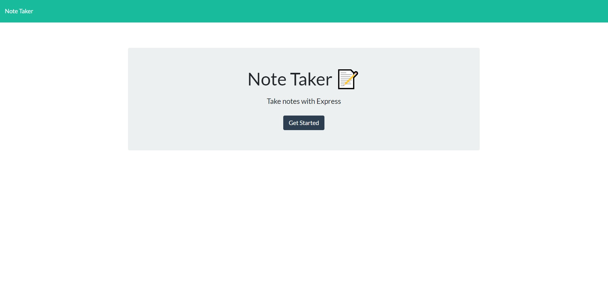
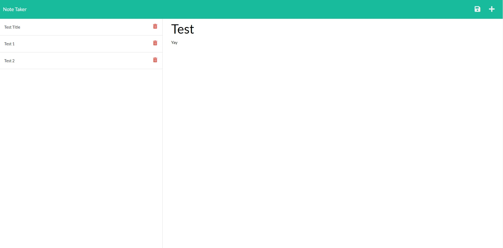

# Note-Taker

## Table of Contents

- [Description](#description)
- [Installation](#installation)
- [Usage](#usage)
- [Tests](#tests)
- [Contributing](#contributing)
- [Questions](#questions)

## Deployed Webpage
(https://serene-plains-44588.herokuapp.com/)

## Screenshot

 ## Description

The purpose of the application is to This app is designed to let the user enter, save, and delete notes via a front end experience. Data is stored in a database..
 
## Installation

uuid as well as express

## Usage

Click on the supplied webpage to run the application

## Tests

Updating to work with Heroku was very buggy. I'm not sure of all that I did to make it compatible, but so far I haven't noticed anything breaking

## Contributing

Please don't

## Questions

My GitHub username is: karpx033

Link @ https://github.com/karpx033

Email: karpx033@umn.edu

Got Questions? 
Send me an email

